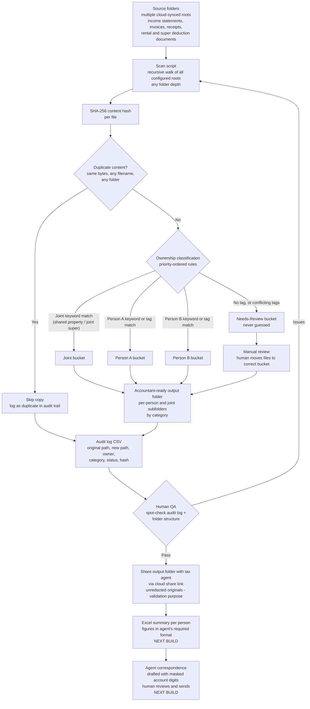
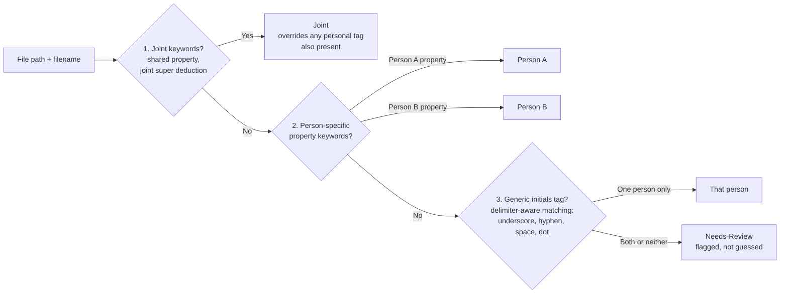
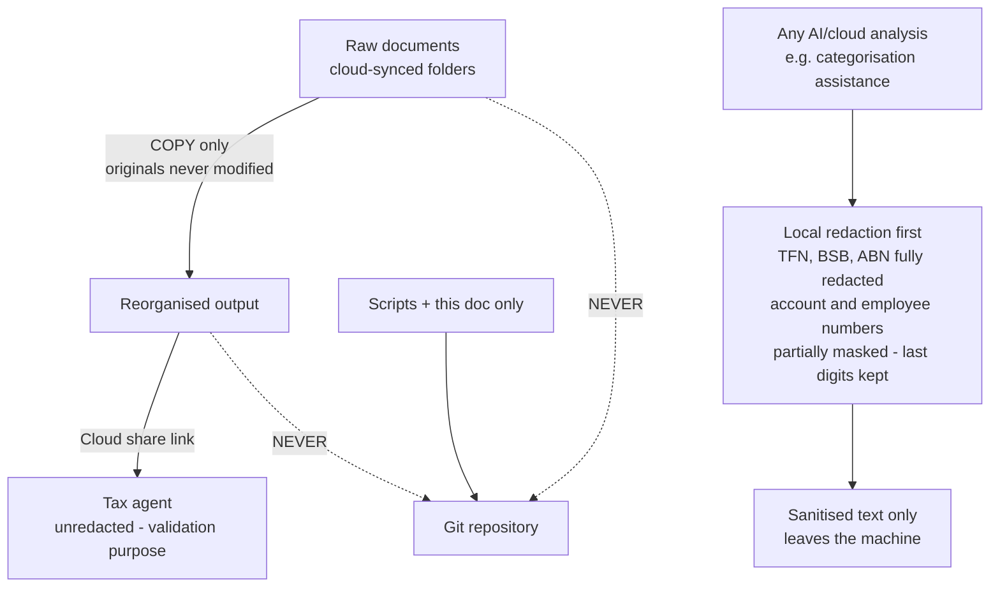

# Tax Document Automation Pipeline — Flow Overview

Privacy-safe architecture documentation. All names, properties, and paths are
genericised. No personal data, real folder paths, or identifying keywords
appear in this repo — classification keywords live only in the local
`config.json` and script copy, which are excluded from version control.

---

## 1. End-to-End Pipeline

---

## 2. Classification Priority (why order matters)

Key design rules:

- **Joint beats personal.** A file tagged with a person's initials but also
  matching a joint-property keyword is classified joint — ownership follows
  the asset, not the person who saved the file.
- **Conflicts are surfaced, never guessed.** A file matching both people's
  tags goes to review. Silent misclassification into the wrong person's tax
  return is the costliest failure mode.
- **Delimiter-aware tag matching.** Initials glued with underscores
  (`XX_Invoice.pdf`) match; substrings inside words (initials inside an
  unrelated word) do not. Standard regex word-boundaries fail on
  underscores, so explicit delimiters are used.

---

## 3. Privacy Controls in This Pipeline

Controls, stated as rules:

1. **Repo contains code and documentation only.** `.gitignore` blocks all
   document formats and output folders; the local `config.json` (which
   contains real paths and classification keywords) is never committed.
2. **Copy, never move.** The reorganisation is non-destructive; sources are
   deleted by a human only after output verification.
3. **Full audit trail.** Every file's original location, destination,
   classification, and content hash is logged per run.
4. **Redaction before any cloud AI step.** A separate local script strips
   tax file numbers, bank identifiers, and addresses, and partially masks
   account-type numbers, before any content is used outside the machine.
5. **Agent communication convention.** Emails reference accounts by last
   digits only (rest masked); full documents are shared exclusively via the
   controlled cloud folder link, never as email attachments.

---

## 4. Current Status and Next Builds

| Stage | Status |
|---|---|
| Redaction script (PDF extraction + PII masking) | Done, tested |
| Scan / dedupe / reorganise across all roots | Done, first real run complete |
| Manual review of unclassified files | In progress (human task) |
| Second person's documents | Pending upload |
| Excel figure summary per person | Next build |
| Agent email drafting workflow (masked digits) | Next build |
